# OKR 系统角色操作手册

更新时间：2026-04-19  
适用范围：当前 `OKRManage` 项目 Web 端

## 1. 文档说明

本文按系统内不同角色拆分说明操作路径，覆盖：

- 登录入口
- 功能菜单与角色权限
- 系统管理员配置
- 员工填写与上传材料
- 科室负责人 / 小组负责人评分与知识管理
- 部门负责人使用说明
- 全员可见页面

## 2. 登录与公共规则

### 2.1 登录方式

系统支持两套登录方式：

1. 企业微信认证优先
2. 当环境未携带企业微信认证信息、企业微信未配置完成，或用户主动退出后，进入账号密码登录页

本地演示环境当前展示的是账号密码登录页。

### 2.2 多角色账号规则

- 同一账号可以同时具备员工、小组负责人、科室负责人、部门负责人等多个角色
- 菜单会按已启用角色自动合并显示
- 当用户进入某个角色专属页面时，系统会自动切换到对应的活动角色，无需手动切角色

### 2.3 季度默认规则

- 所有带季度筛选的页面共用同一套季度选择
- 同一次前端会话内，用户在任一页面切换季度，其他季度页面会跟随
- 每个季度的第一个月默认显示上一个季度，第二个月起默认显示当前季度

示例：

- 2026 年 4 月进入系统，默认显示 `2026 年一季度`
- 2026 年 5 月进入系统，默认显示 `2026 年二季度`
- 2026 年 1 月进入系统，默认显示 `2025 年四季度`

### 2.4 目标与关键结果状态规则

- 目标状态分为：`草稿`、`已确认`、`待评分`、`已评分`
- 关键结果完成状态分为：`未完成`、`完成`
- 员工上传某个 KR 的首份证明材料后，该 KR 会自动标记为 `完成`
- 目标或 KR 只有在 `草稿` 状态下才能继续编辑或删除
- 评分页面会同时显示“是否已提交材料”，方便负责人识别缺材料项

## 3. 角色菜单总览

| 角色 | 可见菜单 |
| --- | --- |
| 系统管理员 | 全部OKR、知识库、系统配置 |
| 员工 | 全部OKR、知识库、我的OKR |
| 小组负责人 | 全部OKR、知识库、评分工作台、评分排名、年度评分排名 |
| 科室负责人 | 全部OKR、知识库、评分工作台、评分排名、年度评分排名 |
| 部门负责人 | 全部OKR、知识库、评分工作台、评分排名、年度评分排名、我的OKR |

补充说明：

- 知识库页面对所有角色开放浏览
- 自由上传知识文件的入口，仅对小组负责人、科室负责人开放
- 手工更新自己上传的自由知识文件时，上传人本人也可继续更新

## 4. 系统管理员操作手册

系统管理员主要负责组织配置、账号角色、负责人绑定、目标状态控制、评价组与模板目标维护。

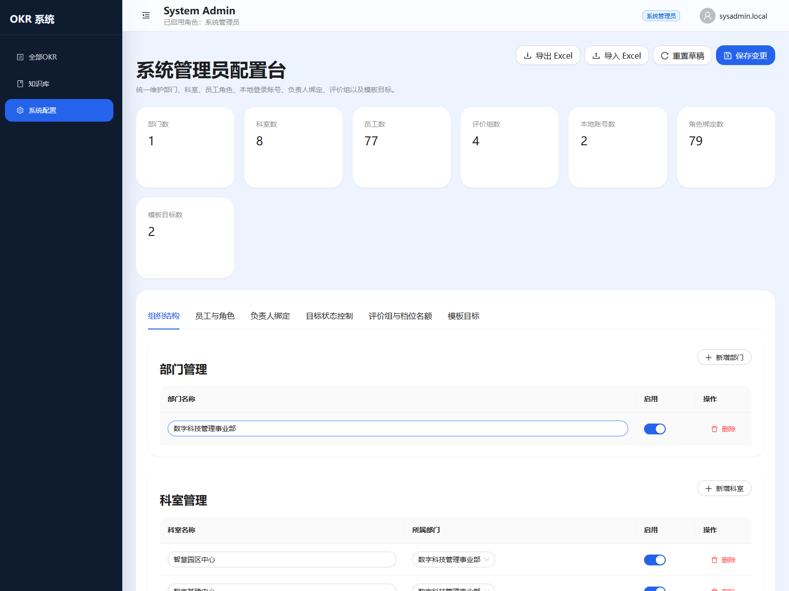

### 4.1 进入系统配置

1. 使用系统管理员账号登录
2. 点击左侧菜单 `系统配置`
3. 页面上方可看到统计概览，包括部门数、科室数、员工数、评价组数、本地账号数、角色绑定数、模板目标数
4. 右上角可执行 `导出 Excel`、`导入 Excel`、`重置草稿`、`保存变更`

### 4.2 组织结构维护

对应页签：`组织结构`

可执行操作：

1. 新增、编辑、启停部门
2. 新增、编辑、启停科室
3. 维护员工基础信息
4. 维护员工岗位、所属科室、所属评价组等基础字段

建议操作顺序：

1. 先建部门
2. 再建科室
3. 再导入或维护员工
4. 最后再做角色和负责人绑定

### 4.3 员工与角色维护

对应页签：`员工与角色`

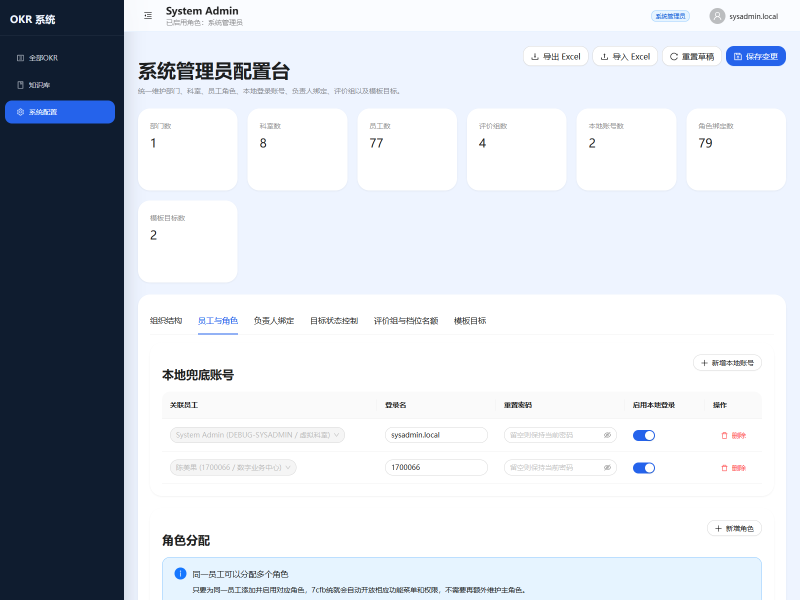

这一页分为两块：

- 本地兜底账号
- 角色分配

#### 本地兜底账号操作

1. 点击 `新增本地账号`
2. 选择关联员工
3. 输入登录名
4. 如需初始化或重置密码，填写密码
5. 通过开关控制是否启用本地登录
6. 点击右上角 `保存变更`

适用场景：

- 企业微信未带认证信息时的兜底登录
- 管理员调试或应急登录
- 用户退出企业微信认证后改用账号密码登录

#### 角色分配操作

1. 点击 `新增角色`
2. 选择关联员工
3. 选择角色类型
4. 开启或关闭该角色
5. 点击 `保存变更`

注意：

- 同一员工可配置多个角色
- 本系统不需要维护“主角色切换逻辑”，只要角色启用，对应菜单即可开放

### 4.4 负责人绑定

对应页签：`负责人绑定`

用于维护：

- 科室负责人对应哪个科室
- 小组负责人对应哪个评价组

建议在完成员工、角色配置后再维护此页，避免负责人范围不完整。

### 4.5 目标状态控制

对应页签：`目标状态控制`

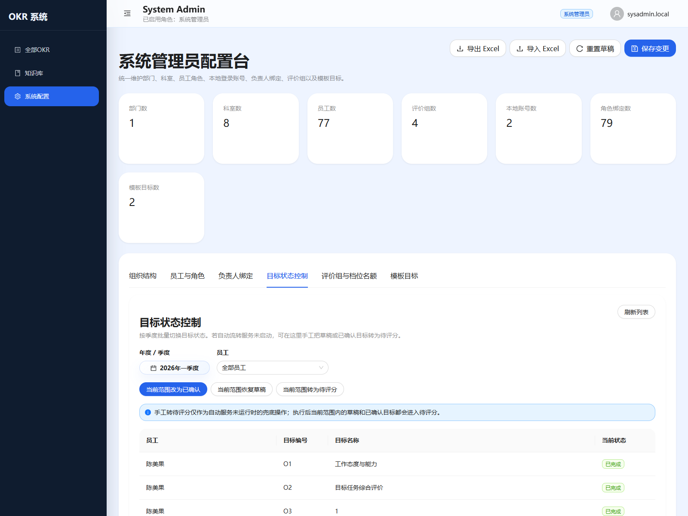

适用场景：

- 自动流转服务未运行时，管理员手工兜底
- 某季度需要批量把草稿 / 已确认目标转为待评分

操作步骤：

1. 选择年度 / 季度
2. 选择员工范围，或保持 `全部员工`
3. 点击页面中的状态批量按钮

可执行动作：

1. `当前范围改为已确认`
2. `当前范围恢复草稿`
3. `当前范围转为待评分`

注意：

- 手工转待评分主要是保险措施
- 系统原本仍按季度规则自动推进目标状态

### 4.6 评价组与档位名额

对应页签：`评价组与档位名额`

这里用于维护：

- 评价组名称
- 各档位名额

建议在正式评分前先核对评价组口径与人数。

### 4.7 模板目标维护

对应页签：`模板目标`

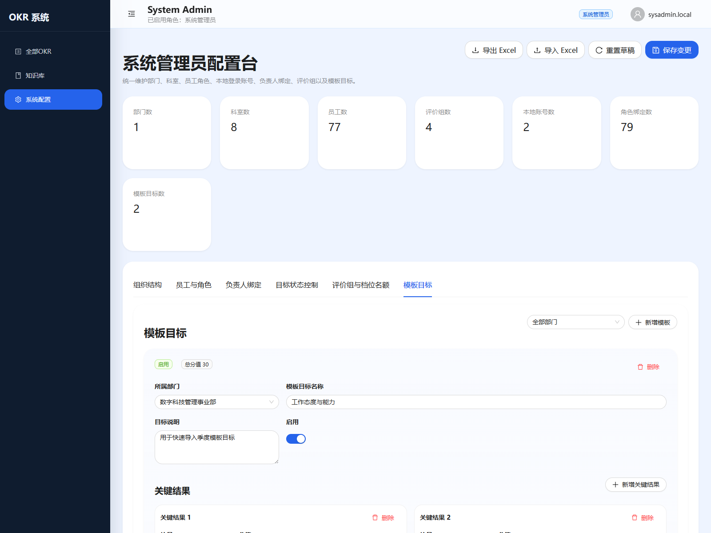

模板目标用于员工快速导入季度目标。

操作步骤：

1. 进入 `模板目标`
2. 新建模板目标
3. 录入模板目标名称、说明
4. 继续维护模板下的多个关键结果
5. 为每个 KR 维护名称、说明、分值、评分类型
6. 保存配置

使用建议：

- 通用模板目标适合做部门统一要求
- 主观评分项建议集中放在模板目标中统一维护，减少员工自行配置偏差

## 5. 员工操作手册

员工端核心页面是 `我的OKR`。

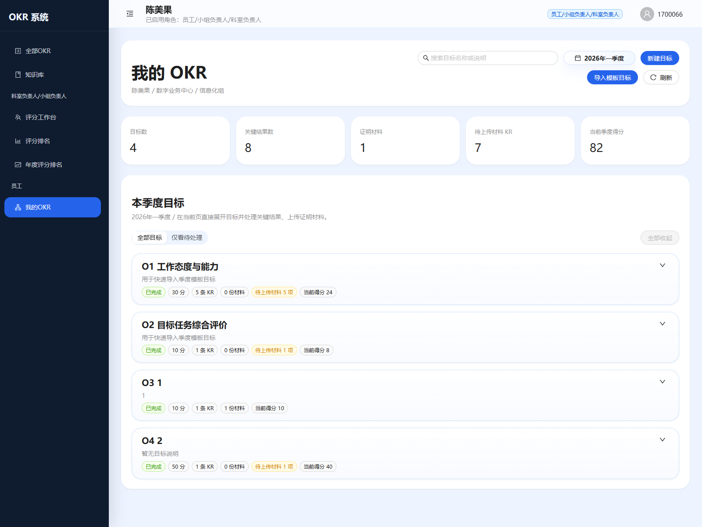

### 5.1 进入我的 OKR

1. 登录系统
2. 点击左侧菜单 `我的OKR`
3. 页面顶部可执行：
   - 搜索目标
   - 切换年份 / 季度
   - 新建目标
   - 导入模板目标
   - 刷新

### 5.2 查看季度概览

页面上方会展示当前季度的汇总信息：

- 目标数
- 关键结果数
- 已上传材料数量
- 待上传材料 KR 数
- 当前季度得分

这部分适合先快速判断当前季度还剩多少待处理项。

### 5.3 新建目标

1. 点击 `新建目标`
2. 录入目标名称与目标说明
3. 逐条录入关键结果
4. 维护每个 KR 的名称、说明、分值、评分类型
5. 保存

注意：

- 每名员工每个季度所有目标下的 KR 总分合计不能超过 100 分
- 新建 KR 时不需要手工选择完成 / 未完成，默认按未完成创建
- 只有草稿状态的目标允许继续编辑与删除

### 5.4 导入模板目标

1. 点击 `导入模板目标`
2. 勾选需要导入的模板
3. 确认导入

适用场景：

- 导入通用态度类目标
- 导入统一评价目标
- 新员工快速生成标准季度目标

### 5.5 展开目标并处理关键结果

1. 在列表中点击某个目标行
2. 展开后可以看到该目标下全部 KR
3. 再点击某个 KR，可打开材料上传与资料列表区域

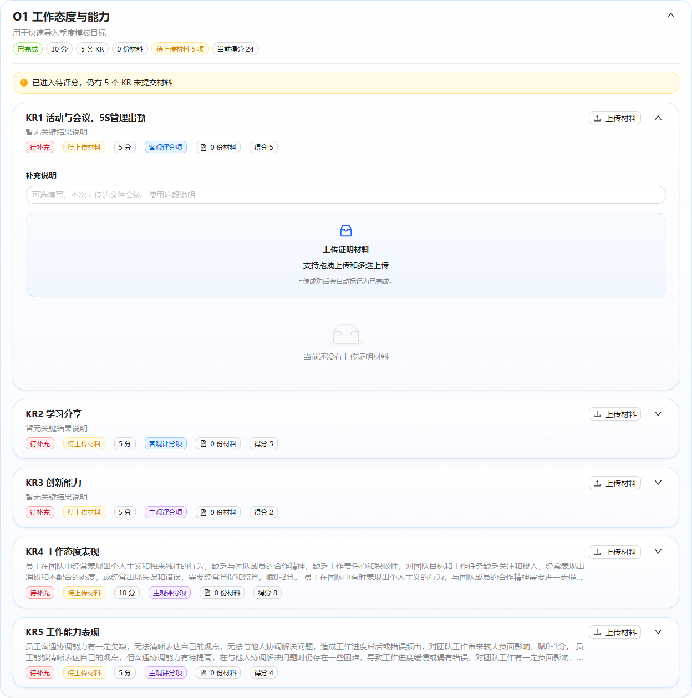

### 5.6 上传证明材料

支持两种方式：

1. 点击 KR 右侧的 `上传材料` 按钮，直接触发文件选择
2. 展开 KR 后，在拖拽上传区域中拖入文件或多选文件

当前支持能力：

- 支持拖拽上传
- 支持多文件上传
- 支持所有文件类型上传
- 上传过程显示进度
- 上传成功后自动把该 KR 标记为完成

推荐操作步骤：

1. 先在 `补充说明` 中填写本次材料说明
2. 再一次性上传对应文件
3. 上传完成后，用 `预览` 或 `下载` 检查文件是否正确

### 5.7 预览与下载材料

员工可在 KR 下方材料列表中直接：

1. 点击 `预览`
2. 点击 `下载`

说明：

- 预览会在新窗口打开
- 外部文件与压缩包内文件的预览入口逻辑已统一

### 5.8 编辑与删除范围

员工在 `草稿` 状态下可：

- 编辑目标
- 删除目标
- 删除 KR

目标一旦进入：

- 已确认
- 待评分
- 已评分

就不再允许删除或随意改结构。

## 6. 科室负责人 / 小组负责人操作手册

负责人主要使用三个页面：

- 评分工作台
- 评分排名
- 年度评分排名

如果该账号同时也是员工，还会同时看到 `我的OKR`。

### 6.1 评分工作台

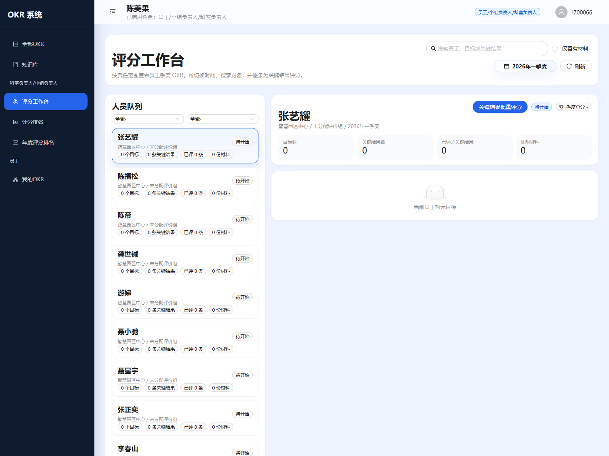

进入步骤：

1. 点击左侧菜单 `评分工作台`
2. 在左侧人员队列中按科室、小组筛选
3. 选择员工
4. 在右侧查看该员工的目标与 KR

左侧主要功能：

- 科室筛选
- 小组筛选
- 搜索员工 / 目标 / KR
- 仅看有材料

右侧主要功能：

- 查看员工季度概览
- 选择目标
- 查看关键结果详情
- 逐条评分
- 预览 / 下载材料
- 将材料标记为知识

### 6.2 单条评分操作

1. 在左侧选中员工
2. 在右侧切换到目标
3. 找到关键结果
4. 输入分数
5. 填写评分备注
6. 输入框失焦后自动保存

评分时建议重点核对：

- 该 KR 是否有证明材料
- 该 KR 是客观评分项还是主观评分项
- 当前目标是否已进入待评分 / 已评分状态

### 6.3 批量评分

工作台右上角提供 `关键结果批量评分` 按钮。

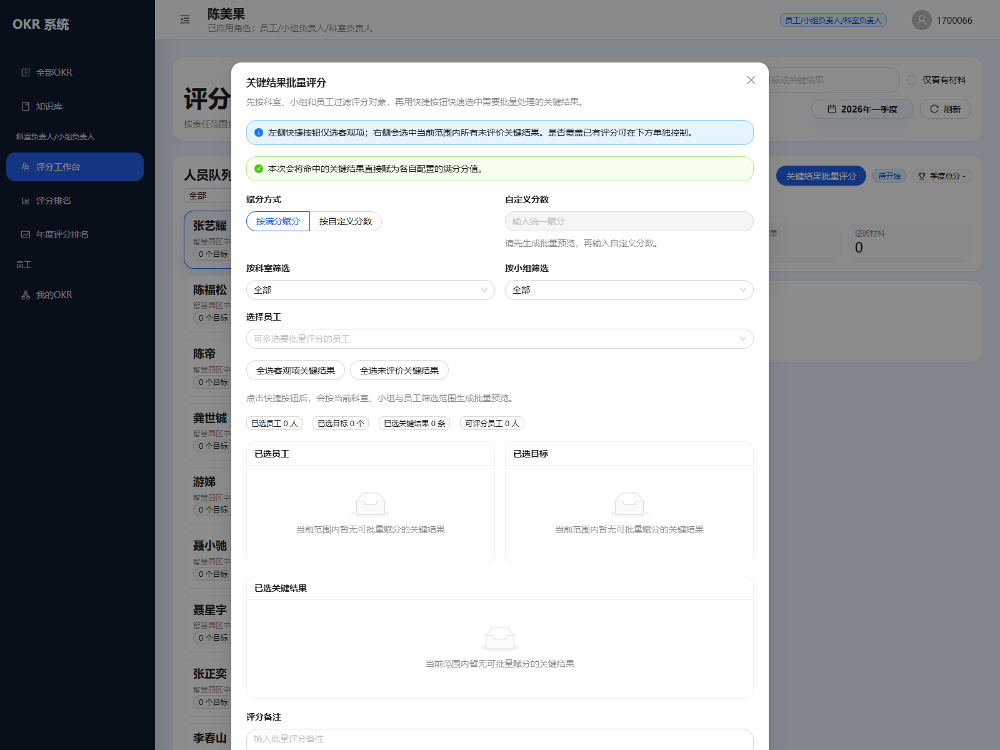

操作步骤：

1. 点击 `关键结果批量评分`
2. 选择科室、小组、员工范围
3. 通过快捷按钮选中：
   - 全选客观项关键结果
   - 全选未评价关键结果
4. 选择赋分方式：
   - 按满分赋分
   - 按自定义分数
5. 如需要，填写批量评分备注
6. 确认保存

注意：

- 若 KR 未提交材料，系统默认不会参与批量赋分
- 如确需继续赋分，需要显式勾选“允许对未提交材料的关键结果继续批量赋分”
- 当前逻辑支持客观项与主观项分开控制，但“全选客观项关键结果”按钮仍保持只选客观项

### 6.4 材料预览、下载与知识标记

在工作台的 KR 材料列表中，可执行：

1. 预览材料
2. 下载材料
3. 标记为知识

知识标记规则：

- 只有科室负责人、小组负责人可执行知识标记
- 标记后的材料会进入知识库页面统一管理

### 6.5 季度评分排名

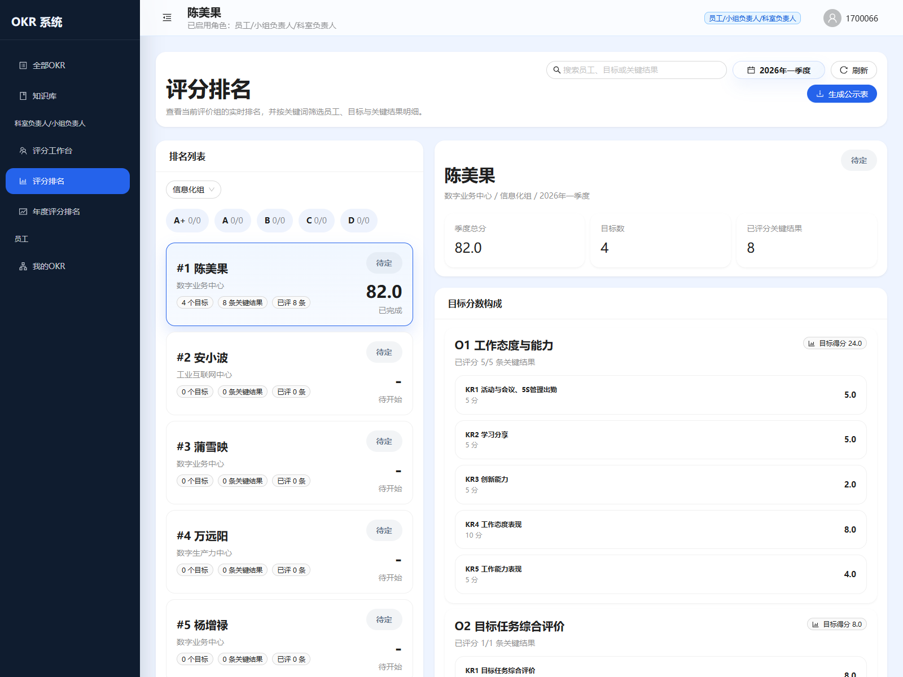

操作步骤：

1. 点击左侧菜单 `评分排名`
2. 选择季度
3. 选择评价组
4. 在左侧排名列表中选择员工
5. 在右侧查看该员工的目标分数构成

负责人可以在该页执行：

- 实时查看同组排名
- 查看目标分数构成
- 一键生成季度公示表 Word 文件

### 6.6 年度评分排名

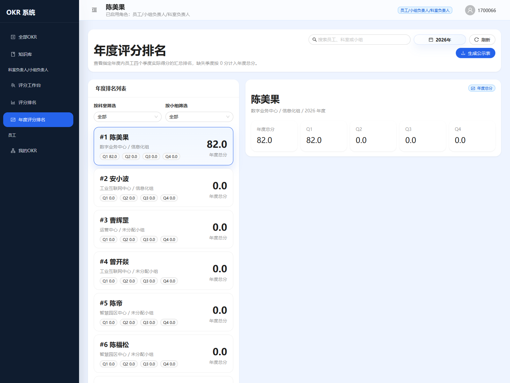

操作步骤：

1. 点击左侧菜单 `年度评分排名`
2. 选择年度
3. 选择科室 / 小组
4. 在左侧查看年度总分排名
5. 在右侧查看员工四个季度汇总分

规则说明：

- 年度排名会保留该年所有员工
- 缺失季度按 0 分计入年度总分
- 页面支持一键生成年度公示表 Word 文件

## 7. 部门负责人操作手册

部门负责人看到的页面与负责人端高度一致，但范围更大。

部门负责人可使用：

- 全部OKR
- 知识库
- 评分工作台
- 评分排名
- 年度评分排名
- 我的OKR

与科室 / 小组负责人相比，主要差异是：

1. 查看和评分范围更大
2. 同时保留个人员工视角
3. 不能进入 `系统配置`

因此部门负责人可直接参考：

- 第 5 章员工操作手册
- 第 6 章负责人操作手册

## 8. 全员共享页面

### 8.1 全部 OKR

`全部OKR` 是只读总览页，所有角色都可以进入。

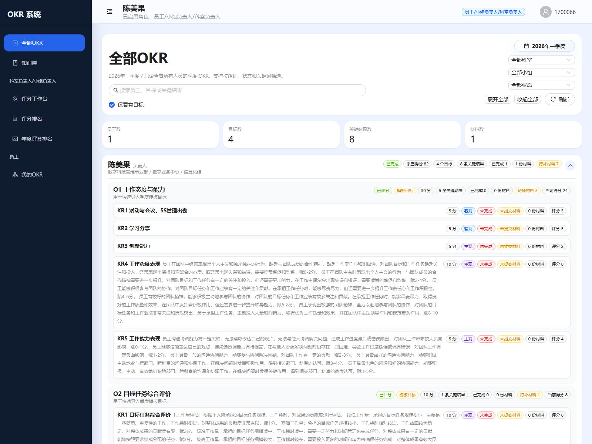

可执行操作：

1. 切换季度
2. 按科室、小组、状态筛选
3. 搜索员工 / 目标 / KR
4. 展开员工查看目标与关键结果详情

适用场景：

- 管理层快速浏览季度 OKR 全貌
- 普通员工查看其他人公开的 OKR 结构
- 做季度横向对比时快速查阅

注意：

- 该页面只用于展示
- 不提供编辑、评分、上传等操作

### 8.2 知识库

`知识库` 页面对所有角色开放。

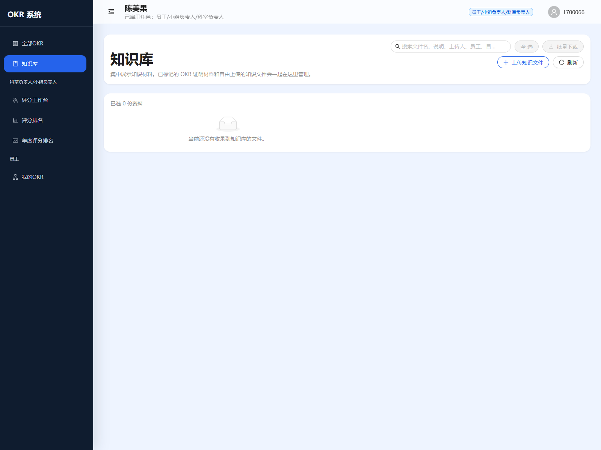

全员可执行：

1. 搜索知识文件
2. 预览知识文件
3. 下载单个知识文件
4. 全选后批量下载

科室负责人 / 小组负责人额外可执行：

1. 自由上传知识文件
2. 更新知识文件与说明
3. 维护被标记为知识的材料

补充说明：

- 自由上传知识文件不关联目标和 KR
- 已标记为知识的 OKR 证明材料会自动展示其关联员工、目标、关键结果信息
- 自由上传文件的上传人后续也可以继续更新自己上传的文件

## 9. 常用业务规则速查

### 9.1 员工填写规则

- 每个季度个人所有 KR 总分合计不得超过 100 分
- 每个 O 的分值等于该目标下所有 KR 分值之和
- 员工没有单独“提交评分”按钮
- 员工平时持续上传材料，到季度节点由系统自动流转目标状态

### 9.2 自动流转规则

- 草稿可编辑
- 已确认表示目标结构已锁定
- 过季后，系统会把符合条件的目标自动推进为待评分
- 评分完成后进入已评分

### 9.3 材料规则

- 不上传材料通常无法支撑后续评分
- 员工上传材料后 KR 自动完成
- 负责人评分时可以明显识别“已提交材料 / 未提交材料”
- 批量评分默认跳过未提交材料项

## 10. 推荐使用路径

### 10.1 员工推荐路径

1. 进入 `我的OKR`
2. 新建目标或导入模板目标
3. 展开目标，持续上传 KR 证明材料
4. 在季度内持续补充材料，不等到最后一天集中处理

### 10.2 负责人推荐路径

1. 先在 `评分工作台` 用筛选器缩小范围
2. 逐个员工检查材料是否齐全
3. 对规则统一的项使用批量评分
4. 在 `评分排名` 和 `年度评分排名` 页面核对排名结果
5. 最后生成公示表

### 10.3 系统管理员推荐路径

1. 先维护组织结构
2. 再维护员工与角色
3. 再维护负责人绑定与评价组
4. 最后维护模板目标与目标状态控制

---

如果后续你希望，我可以继续把这份手册再扩成两版：

1. 面向普通员工的精简版
2. 面向管理员 / 负责人培训的完整版 Word 版
