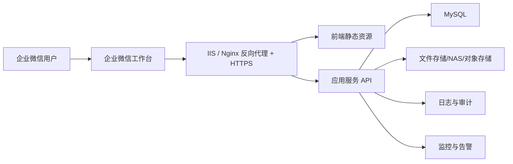

# OKR 系统生产化重构总方案

**日期**

2026-04-08

**目标**

在保留当前业务页面和交互成果的前提下，把现有 MVP 逐步重构为可在公司正式环境长期运行的生产系统。此次方案覆盖：

- 企业微信工作台单入口登录
- MySQL 数据存储
- 文件存储改造
- 服务托管
- HTTPS 与反向代理
- 备份与恢复
- 审计日志
- 并发控制
- 环境配置外置
- 错误监控
- 权限细化

目标不是一次性推倒重写，而是形成一份可分阶段执行的重构路线图，指导后续一步步改代码。

## 一、背景与问题

当前系统已经完成了主要业务能力：

- 员工端 OKR 维护
- 科室领导/小组负责人评分工作台与评分排名
- 系统管理员组织与评价配置
- 材料上传与查看

但当前实现仍然属于 MVP 架构，核心限制如下：

1. 后端是 PowerShell 单体服务，适合原型验证，不适合长期生产运行。
2. 主数据仍存储在 JSON 文件中，不适合并发写入、审计与恢复。
3. 登录态本质上仍是基于全局 `currentUserId` 的演示式会话，不适合多人同时使用。
4. 上传文件存储在本地目录，缺少正式的存储抽象、备份和权限控制。
5. 配置、密钥、运行参数没有完全外置。
6. 缺少正式的监控、审计、恢复和运维闭环。
7. 当前角色模型仍偏单角色，后续“员工兼小组负责人”这类场景需要更细的权限结构。

## 二、当前系统快照

### 当前技术形态

- 前端：原生 HTML/CSS/JS
- 后端：PowerShell `HttpListener`
- 数据：`store.json`
- 文件：本地 `uploads` 目录
- 登录：本地切换用户
- 静态与接口：同一服务承载

### 当前关键代码位置

- 后端服务：[server.ps1](/C:/Users/yanxi/Documents/OKRManage/mvp/server.ps1)
- 前端主状态：[role-app.js](/C:/Users/yanxi/Documents/OKRManage/mvp/public/role-app.js)
- 负责人工作台：[leader-role-overrides.js](/C:/Users/yanxi/Documents/OKRManage/mvp/public/leader-role-overrides.js)
- 评分排名：[review-grade-overrides.js](/C:/Users/yanxi/Documents/OKRManage/mvp/public/review-grade-overrides.js)
- 系统管理员配置：[system-admin-overrides.js](/C:/Users/yanxi/Documents/OKRManage/mvp/public/system-admin-overrides.js)

### 当前最关键的生产风险

1. **全局会话风险**
   - 当前 `Store.settings.currentUserId` 只能支持单用户演示。
2. **数据一致性风险**
   - JSON 文件写入没有真正的事务能力。
3. **并发风险**
   - 多人同时写配置、评分、上传时可能互相覆盖。
4. **运维风险**
   - 服务托管、重启、日志、备份和恢复都不完备。
5. **安全风险**
   - 认证、权限和密钥管理还未达到正式环境要求。

## 三、目标架构

## 3.1 最终目标

推荐把系统演进为：

- 前端仍可保留当前页面结构与交互
- 后端迁移到标准 Web 服务框架
- 数据改为 MySQL
- 文件改为独立文件存储
- 登录改为企业微信工作台授权登录
- 运行在反向代理与 HTTPS 之下

## 3.2 推荐路线

这里有三种路线：

### 路线 A：继续强化 PowerShell 单体

- 在 PowerShell 服务里继续接企业微信登录
- 引入 MySQL
- 增加 session、审计、配置外置、托管

优点：

- 改动最小
- 上线最快

缺点：

- 长期可维护性一般
- 后续扩展成本高

### 路线 B：渐进式迁移到标准后端框架

- 前端先尽量不动
- 先把认证、会话、数据访问、文件访问抽象出来
- 再逐步把 PowerShell 服务迁到 `ASP.NET Core`

优点：

- 风险可控
- 便于分阶段上线
- 更适合长期演进

缺点：

- 需要中期维护两套边界

### 路线 C：整体重写

- 前后端和数据层全部重构

优点：

- 架构最干净

缺点：

- 风险最高
- 周期最长

**推荐：路线 B**

原因：

- 你们现在已经有可用业务系统，不适合推倒重来
- 你们要的是“一步步重构代码”
- 结合公司服务器、企业微信接入、MySQL 和长期维护，路线 B 最平衡

## 3.3 目标部署形态

## 四、重构原则

### 4.1 业务优先

- 不优先重做页面
- 先重做认证、数据、文件、托管这些基础设施

### 4.2 边改边可用

- 每一阶段都要能部署、能回归、能回滚

### 4.3 先抽象，再替换

- 先把“数据访问”“文件存储”“当前用户获取”等逻辑从业务代码里抽出来
- 再替换底层实现

### 4.4 后端权限优先

- 正式环境必须以后端权限为准
- 前端只负责展示，不作为安全边界

### 4.5 配置与代码分离

- 域名、密钥、数据库连接、文件目录、运行模式必须外置

## 五、系统拆分建议

为了后续逐步重构，建议把当前单体拆成这些清晰模块：

### 5.1 认证模块

职责：

- 企业微信授权跳转
- 企业微信 `code -> userid`
- 本地用户映射
- session 管理

### 5.2 组织与权限模块

职责：

- 部门、科室、评价组、负责人绑定
- 角色与角色切换
- 权限校验

### 5.3 OKR 业务模块

职责：

- 目标、关键结果、状态流转
- 评分、汇总、锁定与材料补充规则

### 5.4 文件模块

职责：

- 上传
- 下载
- 删除
- 文件元数据管理
- 文件存储适配

### 5.5 审计与活动模块

职责：

- 配置变更审计
- 评分变更审计
- 材料操作审计
- 登录与权限事件审计

### 5.6 系统配置模块

职责：

- 环境配置读取
- 系统参数配置
- 评分档位名额配置

## 六、企业微信登录改造

这一部分沿用已写设计文档 [2026-04-08-wecom-workbench-login-design.md](/C:/Users/yanxi/Documents/OKRManage/docs/superpowers/specs/2026-04-08-wecom-workbench-login-design.md) 的方案 1。

### 6.1 接入模式

- 仅支持从企业微信工作台进入
- 工作台入口自动登录
- 不保留正式环境的手工切换用户

### 6.2 后端改造要点

- 废弃正式环境中的 `Store.settings.currentUserId`
- 增加：
  - `GET /api/auth/wecom/start`
  - `GET /api/auth/wecom/callback`
  - `POST /api/logout`
  - `GET /api/me`
- 引入服务端 session
- `bootstrap` 改为基于 session 返回当前用户可见数据

### 6.3 用户模型改造

用户增加：

- `wecomUserId`
- `wecomCorpId`
- `isActive`

### 6.4 关键风险

- 如果不先改 session，而只是把企微登录接到当前全局 `currentUserId` 上，会继续串账号

## 七、MySQL 数据存储改造

这是最核心的基础设施改造之一。

## 7.1 为什么必须改

当前 JSON 文件方案不满足：

- 并发写入
- 事务一致性
- 审计查询
- 统计分析
- 正式备份恢复

## 7.2 推荐数据库

推荐：**MySQL 8.x**

原因：

- 企业环境普及度高
- 工具链成熟
- 对当前数据模型完全够用

## 7.3 推荐表结构

建议至少拆成以下表：

### 组织与用户

- `users`
- `user_roles`
- `departments`
- `sections`
- `review_groups`
- `section_leader_bindings`
- `group_leader_bindings`

### 业务对象

- `goals`
- `krs`
- `kr_scores`
- `proofs`
- `activities`

### 配置

- `review_grade_quotas`
- `system_configs`

### 认证与运维

- `sessions`
- `audit_logs`
- `error_logs`

## 7.4 角色模型调整

当前 `users.role` 是单值，不足以满足“一人多角色”。

建议改成：

- `users` 只存基础资料
- `user_roles` 存角色分配
- session 中记录：
  - `userId`
  - `activeRole`

这样能支持：

- 一个用户既是员工又是小组负责人
- 登录后可在允许的角色范围内切换视角

## 7.5 迁移策略

建议分两步：

### 第一步：表结构与 Repository 抽象

- 先在代码里引入数据访问层接口
- 暂时保持 JSON 实现
- 再新增 MySQL 实现

### 第二步：数据迁移

- 从 `store.json` 导出初始数据
- 写一次性迁移脚本入库
- 验证行数、一致性和关键业务对象关联
- 切换运行模式到 MySQL

## 7.6 代码改造建议

当前 [server.ps1](/C:/Users/yanxi/Documents/OKRManage/mvp/server.ps1) 直接操作全量对象。

建议先抽出这些仓储接口：

- `UserRepository`
- `OrgRepository`
- `GoalRepository`
- `KrRepository`
- `ProofRepository`
- `AuditRepository`
- `SessionRepository`
- `ConfigRepository`

哪怕第一阶段仍然用 PowerShell，也要先把“读写 JSON 文件”的逻辑包装进仓储层。

## 八、文件存储改造

## 8.1 当前问题

当前文件直接落在：

- [uploads](/C:/Users/yanxi/Documents/OKRManage/mvp/uploads)

问题：

- 与应用部署目录耦合
- 不便备份
- 不便扩容
- 不便做安全控制

## 8.2 目标结构

文件存储拆成两层：

### 元数据层

放 MySQL：

- 文件 ID
- 原始文件名
- 存储路径
- 文件大小
- MIME 类型
- 上传人
- 所属 KR
- 创建时间
- 删除状态

### 内容层

可选三种：

1. 服务器独立磁盘目录
2. NAS 共享目录
3. 对象存储

建议你们一期先用：

- **独立文件盘或 NAS**

这样和当前服务器环境最贴近。

## 8.3 文件访问抽象

建议抽象：

- `SaveFile`
- `OpenFileStream`
- `DeleteFile`
- `GetFileUrl`

底层实现分为：

- `LocalDiskFileStorage`
- `NasFileStorage`
- 后续可扩展 `ObjectStorageFileStorage`

## 8.4 安全要求

- 文件名不要直接作为磁盘存储名
- 统一生成安全 `storedName`
- 限制大小
- 做扩展名与 MIME 白名单
- 下载时以后端权限校验为准

## 九、服务托管、HTTPS 与反向代理

## 9.1 当前问题

当前服务更像开发态脚本启动，不适合生产。

## 9.2 生产建议

由于你们是 Windows 环境，推荐：

- **IIS 作为反向代理**
- 后端应用服务跑在应用端口
- IIS 统一提供：
  - HTTPS
  - 域名
  - 访问日志
  - 静态资源缓存
  - 反向代理

## 9.3 建议域名与入口

- `https://okr.xxx.com`

企业微信工作台应用主页与回调都走统一正式域名。

## 9.4 托管目标

中期目标：

- 应用服务受 Windows 服务或 IIS 托管
- 应用异常退出可自动拉起

长期目标：

- 迁移到 `ASP.NET Core`
- 用标准宿主方式运行

## 十、备份与恢复

## 10.1 备份对象

必须同时备份：

- MySQL
- 文件存储
- 外置配置

## 10.2 推荐策略

### 数据库

- 每日全量备份
- binlog 或增量备份
- 至少保留最近 7~30 天

### 文件

- 每日增量备份
- 每周全量快照

### 配置

- 环境配置文件纳入运维配置管理

## 10.3 恢复要求

必须能演练：

- 恢复单个文件
- 恢复单日数据库
- 恢复整站

## 十一、审计日志

当前 `activities` 更像业务动态，不等于正式审计。

## 11.1 审计日志必须覆盖

- 登录成功/失败
- 角色切换
- 组织配置变更
- 员工与负责人绑定变更
- 评价组与名额配置变更
- 目标与 KR 修改
- 评分修改
- 材料上传/删除/打开

## 11.2 审计日志字段建议

- `id`
- `actor_user_id`
- `actor_role`
- `action`
- `entity_type`
- `entity_id`
- `before_json`
- `after_json`
- `ip`
- `user_agent`
- `created_at`

## 11.3 审计与活动分层

- `activities`：面向业务页面回显
- `audit_logs`：面向安全与排查

两者不要混用。

## 十二、并发控制

## 12.1 当前风险

多人同时评分、配置、编辑时可能出现覆盖写。

## 12.2 建议策略

### 配置类

采用乐观锁：

- 表增加 `version`
- 提交时带上当前 `version`
- 后端校验版本不一致则拒绝保存

### 评分类

采用更新时间校验：

- KR 评分写入时校验 `updated_at`
- 若数据已被他人修改，则提示刷新

### 文件类

- 上传与元数据写入放在同一业务事务中
- 删除文件时先标记，再异步清理

## 十三、环境配置外置

## 13.1 必须外置的内容

- 企业微信配置
- 数据库连接
- 文件存储根目录
- 运行模式
- Cookie 配置
- 上传限制
- 日志级别
- 监控上报配置

## 13.2 推荐配置项

- `APP_ENV`
- `APP_BASE_URL`
- `AUTH_MODE`
- `WECOM_CORP_ID`
- `WECOM_AGENT_ID`
- `WECOM_SECRET`
- `WECOM_REDIRECT_URI`
- `MYSQL_HOST`
- `MYSQL_PORT`
- `MYSQL_DATABASE`
- `MYSQL_USER`
- `MYSQL_PASSWORD`
- `FILE_STORAGE_MODE`
- `FILE_STORAGE_ROOT`
- `SESSION_TTL_HOURS`
- `UPLOAD_MAX_MB`
- `LOG_LEVEL`

## 13.3 配置读取原则

- 前端不接触敏感配置
- 所有密钥只在服务端读取
- 不把密钥放进 `store.json`

## 十四、错误监控与日志

## 14.1 目标

要能快速回答：

- 哪个接口报错了
- 哪个用户触发的
- 影响了哪个实体
- 当时请求参数和上下文是什么

## 14.2 推荐能力

- 结构化应用日志
- 错误唯一 ID
- 关键接口耗时统计
- 健康检查接口
- 服务异常告警

## 14.3 最低要求

- 请求日志
- 错误日志
- 审计日志
- `/api/health`

## 十五、权限细化

当前系统已经有基础角色，但生产化后需要更明确：

## 15.1 用户与角色分离

角色不应只挂一个字段，建议：

- `users`
- `user_roles`
- `role_scopes`

## 15.2 负责人范围要结构化

例如：

- 科室领导负责某个科室
- 小组负责人负责某个评价组

建议引入范围关系表：

- `section_leader_bindings`
- `group_leader_bindings`

## 15.3 系统管理员分层

后续可考虑拆为：

- `system-admin`
- `system-admin-readonly`

但一期可先不做。

## 15.4 页面权限与接口权限统一

每个关键接口都应以后端为准：

- 查看
- 编辑
- 打分
- 配置
- 材料下载

## 十六、推荐重构阶段

这是本方案最重要的部分，建议按阶段推进。

## 阶段 0：冻结 MVP 基线

目标：

- 冻结当前业务功能
- 建立回归基线

动作：

- 补现有关键回归测试
- 固定演示数据
- 梳理所有正式接口

交付物：

- 基线测试清单
- MVP 回归脚本

## 阶段 1：认证与会话重构

目标：

- 企业微信工作台登录可用
- 正式环境去掉手工切换用户

动作：

- 引入 session
- 新增企业微信授权回调
- 用户模型加 `wecomUserId`
- `bootstrap` 改为按 session 获取

交付物：

- 登录链路可用
- 多人访问不串号

## 阶段 2：权限模型重构

目标：

- 支持一人多角色
- 支持角色切换

动作：

- 拆 `user_roles`
- 重构权限判断函数
- 明确负责人作用范围

交付物：

- 员工兼小组负责人场景可用

## 阶段 3：数据访问层抽象

目标：

- 业务代码不再直接依赖 JSON 全对象

动作：

- 抽 Repository
- 先保留 JSON 实现
- 用接口隔离业务逻辑

交付物：

- 后续可切 MySQL 而不重写整层业务

## 阶段 4：MySQL 落地

目标：

- 主业务数据入 MySQL

动作：

- 建表
- 编写迁移脚本
- 编写 MySQL Repository
- 切换运行模式

交付物：

- 去掉对 `store.json` 的正式依赖

## 阶段 5：文件存储抽象与迁移

目标：

- 文件存储独立于应用部署目录

动作：

- 抽 `FileStorage` 接口
- 文件元数据入库
- 切独立文件盘或 NAS

交付物：

- 上传下载链路正式化

## 阶段 6：服务托管与 HTTPS

目标：

- 正式部署可用

动作：

- 配置 IIS 反向代理
- 接正式域名和证书
- 静态资源与 API 路由梳理

交付物：

- 企业微信工作台正式可访问

## 阶段 7：审计、并发与监控

目标：

- 提升可运维性和数据安全

动作：

- 审计日志入库
- 乐观锁与更新时间校验
- 结构化日志
- 错误监控与告警

交付物：

- 正式运维闭环建立

## 阶段 8：PowerShell 到标准后端框架迁移

目标：

- 长期可维护

动作：

- 逐步把 API 迁到 `ASP.NET Core`
- 保持前端不大改
- 按模块迁移路由与服务

交付物：

- 正式后端完成替换

## 十七、建议的代码重构顺序

结合当前仓库，建议优先动这些点：

1. [server.ps1](/C:/Users/yanxi/Documents/OKRManage/mvp/server.ps1)
   - 先抽认证、当前用户、存储访问
2. [role-app.js](/C:/Users/yanxi/Documents/OKRManage/mvp/public/role-app.js)
   - 去掉正式用户切换入口
3. [system-admin-overrides.js](/C:/Users/yanxi/Documents/OKRManage/mvp/public/system-admin-overrides.js)
   - 增加企业微信 UserId 配置
4. 数据层
   - 先补 Repository 目录
5. 文件层
   - 先补 FileStorage 目录

## 十八、验收标准

### 架构验收

- 不再依赖全局 `currentUserId`
- 主业务数据不再存 JSON
- 文件不再和应用目录强耦合

### 运维验收

- 服务重启可自动恢复
- 有 HTTPS
- 有备份与恢复流程
- 有错误日志和审计日志

### 业务验收

- 员工端正常
- 科室领导/小组负责人端正常
- 系统管理员端正常
- 评分、材料、配置权限不串角色

## 十九、结论

这次重构的核心不是“把某个页面改一下”，而是把系统从 MVP 提升为正式内网生产系统。

最推荐的总体路线是：

- 保留现有前端交互成果
- 先完成企业微信登录、session、权限重构
- 再抽数据层并切 MySQL
- 再抽文件层并切正式存储
- 再补托管、HTTPS、备份、审计、监控
- 最后逐步把 PowerShell 后端迁到标准框架

这样做风险最低，也最符合“可以一步步重构代码”的目标。
