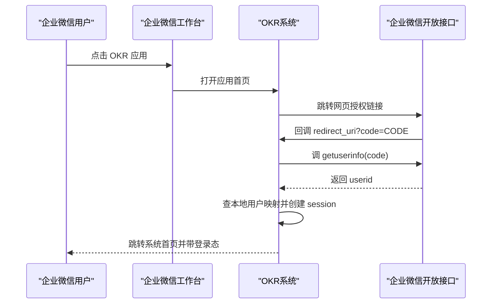

# 企业微信工作台登录接入设计

**日期**

2026-04-08

**目标**

为当前 OKR 系统接入企业微信工作台登录，并采用“方案 1：仅支持从企业微信工作台单入口进入”的模式。用户从企业微信工作台点击应用后，系统自动完成身份识别与登录，不再依赖当前 MVP 的“前端切换用户”方式。企业微信负责身份认证，本系统继续负责角色、组织、评价组、评分权限和业务数据控制。

**官方依据**

- 企业微信网页授权支持在工作台内发起，授权后会跳转到 `redirect_uri?code=...`，服务端可根据 `code` 获取成员身份。
- `snsapi_base` 可静默获取成员基础信息 `UserId`。
- 使用 `code` 调用 `getuserinfo` 可获取成员 `userid`。
- 跳转域名必须匹配应用可信域名，否则会返回 `50001`。

参考文档：

- https://developer.work.weixin.qq.com/document/path/91022
- https://developer.work.weixin.qq.com/document/path/91023
- https://developer.work.weixin.qq.com/document/path/90514

## 一、范围与边界

### 本次纳入

- 企业微信工作台单入口登录
- 后端基于企业微信 `userid` 完成账号识别
- 本系统基于本地用户角色继续做权限判断
- 去掉正式环境下的“手工切换当前用户”登录方式
- 支持移动端企业微信和桌面端企业微信工作台进入

### 本次不纳入

- 企业微信外部浏览器直接登录
- 企业微信 Web 登录组件兜底
- 企业微信通讯录自动同步
- 与公司统一 SSO 二次整合
- 多租户支持

## 二、当前系统现状

当前系统是一个 PowerShell 单体服务加原生前端页面的 MVP 结构：

- 后端服务入口在 [server.ps1](/C:/Users/yanxi/Documents/OKRManage/mvp/server.ps1)
- 前端主状态在 [role-app.js](/C:/Users/yanxi/Documents/OKRManage/mvp/public/role-app.js)
- 页面入口在 [index.html](/C:/Users/yanxi/Documents/OKRManage/mvp/public/index.html)
- 当前“登录态”本质上是全局存储在 `Store.settings.currentUserId`
- 当前切换用户接口是 `PUT /api/session`
- `GET /api/bootstrap` 会按全局当前用户裁剪返回数据

当前做法只适合单人演示，不适合正式部署，主要问题：

1. `currentUserId` 是全局状态，多人同时访问会串账号。
2. 前端允许直接切换账号，不符合正式认证要求。
3. 服务端没有真正的独立会话机制。
4. 用户和外部身份体系没有绑定字段。

## 三、推荐接入方案

采用“企业微信工作台入口 + 网页授权 + 本系统会话”的方式。

### 登录流程

### 登录原则

- 企业微信只负责“这个人是谁”
- 本系统负责“这个人能看什么、能做什么”
- 本地用户仍然是权限主体
- 企业微信 `userid` 是登录唯一外部标识

## 四、账号与角色模型

### 本地用户新增字段

当前用户数据需要增加：

- `wecomUserId`
  - 企业微信成员 `userid`
  - 必填
  - 系统内唯一
- `wecomCorpId`
  - 企业 CorpId
  - 可选
  - 便于后续多企业兼容
- `loginSource`
  - 初始可固定为 `wecom`
  - 便于后续扩展
- `isActive`
  - 账号是否允许登录

### 角色继续保留在本系统

当前业务角色不建议交给企业微信原生组织架构自动推断，继续由本系统维护：

- `employee`
- `section-leader`
- `group-leader`
- `system-admin`

原因：

- 同一个企业微信成员可能同时承担员工与小组负责人职责
- 角色和评分权限是业务逻辑，不是单纯通讯录关系
- 系统管理员角色明显是应用内部权限，不宜仅依赖企微组织层级

## 五、后端改造

### 1. 废弃全局 currentUser 作为正式登录态

以下逻辑要退出正式登录主链路：

- [server.ps1](/C:/Users/yanxi/Documents/OKRManage/mvp/server.ps1#L1455) `Update-Session`
- [server.ps1](/C:/Users/yanxi/Documents/OKRManage/mvp/server.ps1#L803) `Get-CurrentUser`
- [server.ps1](/C:/Users/yanxi/Documents/OKRManage/mvp/server.ps1#L1394) `Build-BootstrapPayload`

改造后：

- `Get-CurrentUser` 不再读取 `Store.settings.currentUserId`
- 改为从请求 Cookie 中解析 `sessionId`
- 再通过 session 存储查到当前登录用户

### 2. 新增认证接口

建议新增：

- `GET /api/auth/wecom/start`
  - 构造企业微信网页授权地址
  - 302 跳转至企业微信授权链接
- `GET /api/auth/wecom/callback`
  - 接收 `code`
  - 调企业微信 `getuserinfo`
  - 拿到 `userid`
  - 匹配本地用户
  - 创建 session
  - 再跳回首页
- `POST /api/logout`
  - 删除当前 session
- `GET /api/me`
  - 返回当前登录用户概要信息

### 3. 新增 session 机制

建议 session 采用服务端会话：

- 生成随机 `sessionId`
- 通过 `Set-Cookie` 下发 HttpOnly Cookie
- Cookie 至少设置：
  - `HttpOnly`
  - `Secure`
  - `SameSite=Lax`
- session 服务端存储建议先使用独立 JSON 或内存 + 文件落盘
- 正式生产更建议迁移到数据库表

建议新增数据结构：

- `sessions`
  - `id`
  - `userId`
  - `createdAt`
  - `expiresAt`
  - `lastSeenAt`
  - `ip`
  - `userAgent`

### 4. 新增企业微信接口调用封装

建议在后端新增一组封装函数：

- `Get-WecomAccessToken`
- `Build-WecomOauthUrl`
- `Get-WecomUserIdentityByCode`
- `Find-LocalUserByWecomUserId`
- `Create-Session`
- `Get-CurrentUserFromRequest`

其中 `Get-WecomUserIdentityByCode` 的核心逻辑：

1. 用应用 `Secret` 获取 `access_token`
2. 调 `getuserinfo?access_token=...&code=...`
3. 读取返回的 `userid`
4. 找本地用户
5. 若找不到则拒绝登录

### 5. bootstrap 返回逻辑调整

当前 `GET /api/bootstrap` 依赖全局当前用户。改造后：

- 每次请求根据当前 cookie session 识别用户
- 再按当前用户角色裁剪可见数据
- 不再依赖系统级的 `Store.settings.currentUserId`

这样可以保证多人同时访问时各自独立。

### 6. 权限与失败处理

建议约定以下错误场景：

- `code` 缺失：返回 400
- 企业微信接口失败：返回 502 或重定向到错误页
- `userid` 未绑定本地账号：返回 403，并提示“当前企业微信账号未开通系统权限”
- 用户被停用：返回 403
- session 失效：返回 401

## 六、前端改造

### 1. 去掉正式登录入口中的用户切换

当前前端仍保留演示式用户切换：

- [index.html](/C:/Users/yanxi/Documents/OKRManage/mvp/public/index.html#L48)
- [role-app.js](/C:/Users/yanxi/Documents/OKRManage/mvp/public/role-app.js#L236)

正式环境改造建议：

- 隐藏用户切换器
- 页面头部改成展示“当前登录人”
- 应用启动时先请求 `/api/bootstrap`
- 若返回 401，则跳 `/api/auth/wecom/start`

### 2. 增加登录态初始化逻辑

前端初始化流程改成：

1. 页面加载
2. 请求 `/api/bootstrap`
3. 已登录则进入系统
4. 未登录则跳企业微信授权

### 3. 增加登录失败页

建议新增一个轻量错误页或错误态容器，用于显示：

- 未开通账号
- 账号未配置角色
- 企业微信回调失败
- 会话过期

### 4. 管理员端用户配置页增加企微字段

系统管理员配置页面中，员工配置至少需要新增：

- 企业微信 UserId
- 是否启用

建议在 [system-admin-overrides.js](/C:/Users/yanxi/Documents/OKRManage/mvp/public/system-admin-overrides.js) 中为“员工与角色”模块增加这两个字段，并在保存时一并提交。

## 七、数据结构改造

### users

用户数据建议从：

- `id`
- `name`
- `role`
- `departmentId`
- `sectionId`
- `reviewGroup`

扩展为：

- `id`
- `name`
- `role`
- `departmentId`
- `sectionId`
- `reviewGroup`
- `wecomUserId`
- `wecomCorpId`
- `isActive`

### settings

当前保留 `currentUserId` 只用于本地开发或兼容调试，不作为正式登录依据。

建议：

- 标记为 `devOnly`
- 生产配置关闭“切换用户”入口

### sessions

新增 `sessions` 存储。

若仍暂时使用 JSON 文件，建议独立文件：

- `mvp/data/sessions.json`

避免与主业务数据混写。

## 八、配置项改造

建议新增环境配置：

- `WECom_CorpId`
- `WECom_AgentId`
- `WECom_Secret`
- `WECom_RedirectUri`
- `WECom_TrustedDomain`
- `APP_BaseUrl`
- `SESSION_CookieName`
- `SESSION_TTL_Hours`

这些值不应硬编码在前端或主数据文件中。

## 九、企业微信后台配置要求

需要由企业微信管理员完成：

1. 创建或配置自建应用
2. 设置应用可见范围
3. 配置应用主页 URL
4. 配置可信域名
5. 获取 `CorpId / AgentId / Secret`

建议正式 URL：

- 应用主页：`https://okr.xxx.com/`
- 回调地址：`https://okr.xxx.com/api/auth/wecom/callback`

注意：

- 页面域名与回调域名都应在可信域名体系内
- 服务器必须支持 HTTPS
- 手机企业微信访问时需要能直接访问正式域名

## 十、兼容策略

为了不影响当前开发演示，可保留双模式：

### 开发模式

- 允许继续使用本地切换用户
- 允许 `Store.settings.currentUserId`
- 方便本地联调多角色

### 生产模式

- 关闭用户切换器
- 强制企业微信登录
- 忽略全局 `currentUserId`

建议通过配置项控制：

- `AUTH_MODE=dev-switch`
- `AUTH_MODE=wecom`

## 十一、安全要求

- Cookie 必须 `HttpOnly + Secure`
- callback 接口校验 `state`
- access token 仅保存在服务端
- 不在前端暴露 `Secret`
- 未绑定用户禁止进入系统
- 系统管理员账号必须显式绑定本地角色，不能仅凭企业微信组织层级自动获得

## 十二、测试与联调

### 后端测试

- 已登录用户访问 `/api/bootstrap` 成功
- 未登录访问 `/api/bootstrap` 返回 401
- callback 中合法 `code` 能换到本地用户
- 未绑定 `userid` 时返回拒绝登录
- session 过期后接口返回 401

### 前端测试

- 企业微信工作台点开可自动进入
- 移动端企业微信表现正常
- PC 企业微信工作台表现正常
- 刷新页面不丢登录态
- 退出登录后重新进入能重新授权

### 角色回归

- 员工端
- 科室领导/小组负责人端
- 系统管理员端

均需验证登录后页面和权限不串角色。

## 十三、实施顺序建议

建议按以下顺序实施：

1. 后端增加 session 机制
2. 后端增加企业微信授权回调
3. 用户模型增加 `wecomUserId`
4. bootstrap 改为按 session 识别用户
5. 前端增加未登录跳转逻辑
6. 隐藏正式环境用户切换器
7. 系统管理员页补企业微信 UserId 配置
8. 联调企业微信工作台入口
9. 回归所有角色页面

## 十四、风险与注意事项

### 1. 当前全局会话模型必须改

这是本次改造最关键的点。如果不改，即使接上企业微信登录，多人同时用时仍会串账号。

### 2. 本地账号映射必须先准备

如果企业微信 `userid` 与本地用户没有提前绑定，登录后会出现大量“能认证但进不了系统”的情况。

### 3. 服务器必须稳定支持公网 HTTPS

你们已经确认服务器可开放外网访问，这个前提满足后，工作台接入才适合推进。

### 4. 文件上传与 session 要分离

当前上传链路已可用，但后续鉴权需要从 cookie session 识别当前用户，避免沿用旧的全局 current user。

## 十五、结论

方案 1 可以直接落地到当前系统，且与当前业务最匹配。

真正需要改造的重点不是页面，而是认证与会话层：

- 把“全局切换用户”改为“企业微信身份 + 服务端独立 session”
- 把“本地演示账号”改为“企业微信 userid 与本地角色映射”
- 保持现有员工端、负责人端、系统管理员端业务权限模型不变

这样能以最小业务改动，把当前 MVP 提升到可在企业微信工作台内正式使用的形态。
